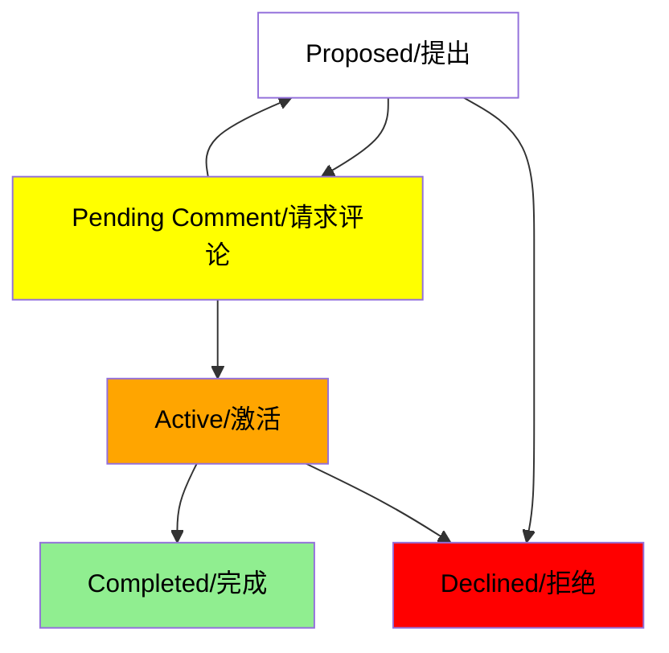

Electron 的 [API 工作组](https://github.com/electron/governance/tree/main/wg-api) 正在采用开放的 **征求意见 (RFC)** 流程来帮助引导更大的变更
到 Electron core。

## 为什么要使用 RFC？

简而言之，我们希望顺利完成 Electron core 重大变更的落地过程。

目前，新的代码主要通过 GitHub 上的 issues 和拉取代码合并请求进行变更的。对于 Electron 的大多数更改，这是一个很好的体系。 许多错误修复、文档更改、甚至新功能也足够简单，可以通过以下方式异步审查和合并标准 GitHub 流程。

对于更重大的变化-例如，大型 API 或会影响大多数 Electron 应用程序的破坏性更改，在
构思阶段进行审查是有意义的。

这个过程旨在对公众开放，这也将使得广大开源社区能够在这些变化落实到 Electron 之前，更容易地提供反馈。

## 它是如何工作的？

整个 RFC（请求评论）过程托管在 GitHub 上的 [electron/rfcs](https://github.com/electron/rfcs) 仓库中。 步骤在仓库的 [README](https://github.com/electron/rfcs/blob/main/README.md) 中有详细描述。

简而言之，一旦向 `electron/rfcs` 仓库提交了 PR，一个 RFC 就被**提出**了。
一个被提出的 RFC 会变成：

- **Active**，当 PR 被合并到仓库的 `main` 分支时，这意味着 Electron 的维护者对在 `electron/electron` 中实施该提案持开放态度，或者
- **Declined**，如果 PR 最终被拒绝。

:::info

要使 RFC 变为 **Active** 状态，PR 必须至少获得 2 名 API 工作组成员的批准。
在合并之前，RFC 应该同步地被呈现，并且至少有三分之二的工作组（WG）成员一致同意才能被接受。 如果达成共识，将触发为期一个月的最终评论期，之后将合并 PR。

:::

如果实施已经合并到 `electron/electron` 中，一个激活的 RFC 就被视为 **Completed**。

## 谁可以参与？

Electron 社区中的任何人都可以提交 RFC 或在 `electron/rfcs` 仓库上留下反馈！

- 要查看活跃 RFC 的列表，请参阅仓库中的 [`text` 文件夹](https://github.com/electron/rfcs/tree/main/text)。
- 要对提出的 RFC 留下反馈，请查看[开放的 PR 的列表](https://github.com/electron/rfcs/pulls)。
- 要提交一个新的 RFC，请查看仓库的 [README](https://github.com/electron/rfcs) 和 [RFC 模板](https://github.com/electron/rfcs/blob/main/0000-template.md)。

我们希望将这个过程变成一种双向对话，并鼓励社区参与，以便从可能在未来使用这些 API 的 Electron 应用程序中获得多样化的意见。 如果你
对当前提出的 RFC 留下反馈感兴趣，Electron 的维护者们已经创建了
我们希望将这个过程变成一种双向对话，并鼓励社区参与，以便从可能在未来使用这些 API 的 Electron 应用程序中获得多样化的意见。 如果你对当前提出的 RFC 留下反馈感兴趣，Electron 的维护者们已经创建了一些：

- [Electron C APIs](https://github.com/electron/rfcs/pull/3)
- [Preload Realm for Service Workers](https://github.com/electron/rfcs/pull/4)

## 致谢

Electron 的 RFC 流程借鉴了许多已建立的开源 RFC 流程。
许多想法和主要文案的灵感来源于：

- [emberjs/rfcs](https://github.com/emberjs/rfcs)
- [reactjs/rfcs](https://github.com/reactjs/rfcs)
- [rust-lang/rfcs](https://github.com/rust-lang/rfcs)
- [tauri-apps/rfcs](https://github.com/tauri-apps/rfcs)
- [vuejs/rfcs](https://github.com/vuejs/rfcs)
- [yarnpkg/rfcs](https://github.com/yarnpkg/rfcs)
